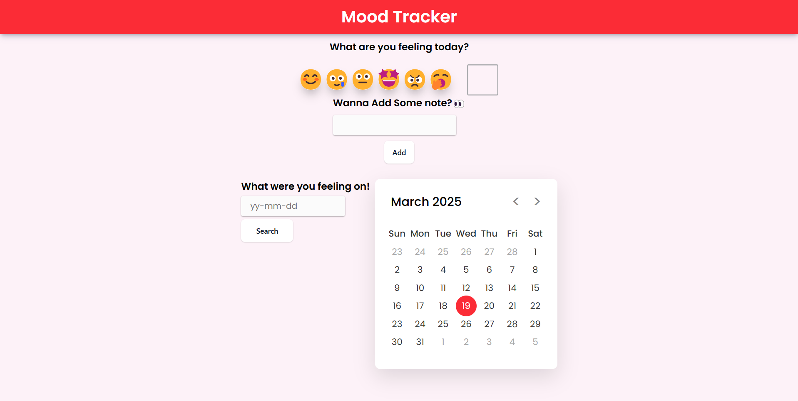

# Mood Tracker 🌦️

A simple web application to track and visualize your daily moods using HTML, CSS, and JavaScript.

## Features ✨

- 📅 **Daily Mood Logging**
  - Record your mood with a note for each day
  - 1 mood entry per calendar day
- 🔍 **Date Search**
  - Find past mood entries by specific dates
- 🗓️ **Interactive Calendar View**
  - Visual monthly calendar display
  - Click any date to view stored moods
- 💾 **Local Storage**
  - All data persists in browser storage
  - No login required - your data stays private

## Screenshots 📸

### Interface

### Mood View

## How to Use 🚀

### Adding a Mood

1. Open the application
2. Select today's date (default)
3. Choose your mood level
4. Add an optional note
5. Click "Add"

### Searching Moods

1. Click the search icon
2. Enter date in YYYY-MM-D format
3. View results instantly

### Calendar Navigation

1. Click the calendar icon
2. Browse through months using arrows
3. Click any highlighted date to view entry
